<div align="center">

  <!-- Header Banner -->
  

  <br/><br/>

  <!-- Dynamic Typing Effect Headline -->
  <a href="https://git.io/typing-svg">
    
  </a>

  <br/>

  <!-- Social & Contact Quick Badges -->
  <p align="center">
    <a href="https://linkedin.com/in/a-joshika-git"></a>
    <a href="mailto:ankinapallijoshika@gmail.com"></a>
    <a href="https://github.com/a-joshika-git"></a>
    <a href="https://kaggle.com"></a>
  </p>

</div>

---

### 🧠 About Me

```yaml
name: Joshika Ankinapalli
role: AI & Data Analytics (AIDA) Engineering Student
degree: Bachelor of Technology / Engineering in AIDA
mission: "Democratizing intelligent solutions by integrating AI into everyday software"
core_belief: "Every engineering barrier can be solved or amplified through thoughtful AI integration."
interests: [Generative AI, Multi-Agent Systems, Deep Learning, Predictive Data Science, LLM Ops]
status: 🚀 Actively seeking AI / ML Internships, Research & Hackathon Collaborations
```

- 🎓 **Undergraduate Student**: Pursuing **Artificial Intelligence & Data Analytics (AIDA)**.
- 💡 **My Philosophy**: I strongly believe that traditional software limitations can be overcome with **intelligent AI integration**—transforming static workflows into dynamic, adaptive systems.
- 🔬 **Current Focus**: Architecting RAG (Retrieval-Augmented Generation) applications, fine-tuning open-source LLMs, and building end-to-end data analytics pipelines.
- 🛠️ **Engineering Mindset**: Combining rigorous statistical data analytics with modern software engineering (FastAPI, React, Vector DBs, Docker).
- 🤝 **Open to**: AI/ML research collaborations, hackathons, open-source AI projects, and engineering internships.

---

### 🧰 Technical Arsenal & AI Stack

<div align="center">

#### **AI, Machine Learning & Deep Learning**
<a href="https://skillicons.dev">
  
</a>

<br/>

#### **Data Science, Analytics & Database Engines**
<a href="https://skillicons.dev">
  
</a>

<br/>

#### **Full-Stack Integration, APIs & Cloud Tools**
<a href="https://skillicons.dev">
  
</a>

</div>

---

### 🚀 Featured AI & Analytics Projects

| Project | Core AI & Tech Stack | Description & Impact | Links |
| :--- | :--- | :--- | :---: |
| **🤖 OmniAgent Copilot** | `Python` `LangChain` `ChromaDB` `FastAPI` `Next.js` | Intelligent multi-agent RAG system that automates complex enterprise research, document summarization, and query reasoning. | [Repo](https://github.com/a-joshika-git) |
| **📈 InsightFlow Analytics** | `Python` `Pandas` `Scikit-Learn` `Streamlit` `PostgreSQL` | End-to-end predictive analytics engine providing real-time data visualisations, anomaly detection, and customer churn forecasting. | [Repo](https://github.com/a-joshika-git) |
| **👁️ VisionDefect AI** | `PyTorch` `OpenCV` `FastAPI` `Docker` | High-precision computer vision pipeline identifying manufacturing anomalies and defect classifications in real-time video streams. | [Repo](https://github.com/a-joshika-git) |
| **⚡ SmartDocs AI Summarizer** | `HuggingFace` `Transformers` `FastAPI` `React` | Production-grade NLP text summarizer and entity extraction microservice integrated into a modern web client. | [Repo](https://github.com/a-joshika-git) |

---

### 📊 GitHub Activity & Metrics

<div align="center">

  <!-- Streak Stats & Main Stats -->
  <a href="https://github.com/anuraghazra/github-readme-stats">
    
  </a>
  <a href="https://github.com/anuraghazra/github-readme-stats">
    
  </a>

  <br/><br/>

  <!-- Top Languages Compact -->
  <a href="https://github.com/anuraghazra/github-readme-stats">
    
  </a>

</div>

---

### 🤝 Connect & Collaborate

<p align="center">
  <b>Passionate about pushing the frontiers of AI integration? Let's connect!</b><br/>
  Always excited to brainstorm AI architectures, participate in hackathons, or explore research opportunities.
</p>

<p align="center">
  <a href="mailto:ankinapallijoshika@gmail.com"></a>
  <a href="https://linkedin.com/in/a-joshika-git"></a>
  <a href="https://github.com/a-joshika-git"></a>
</p>
